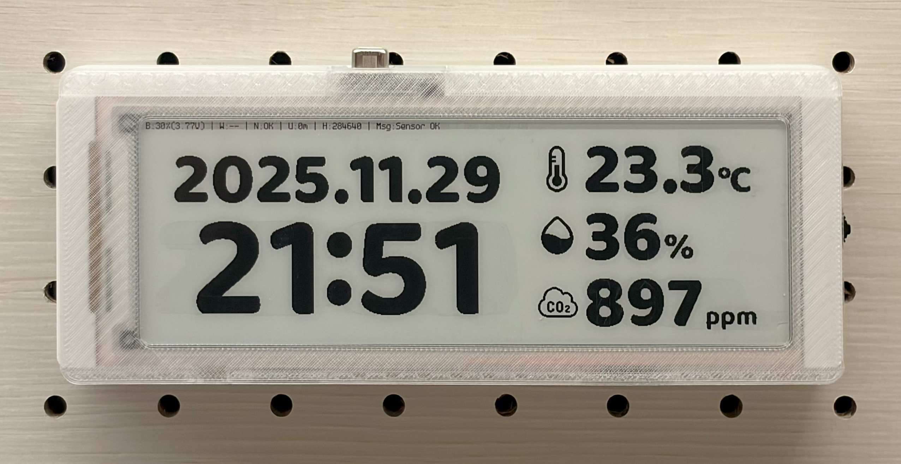
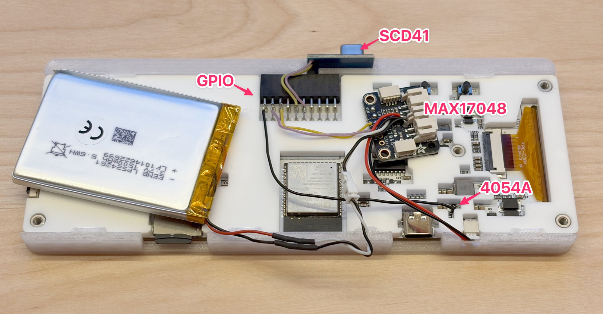
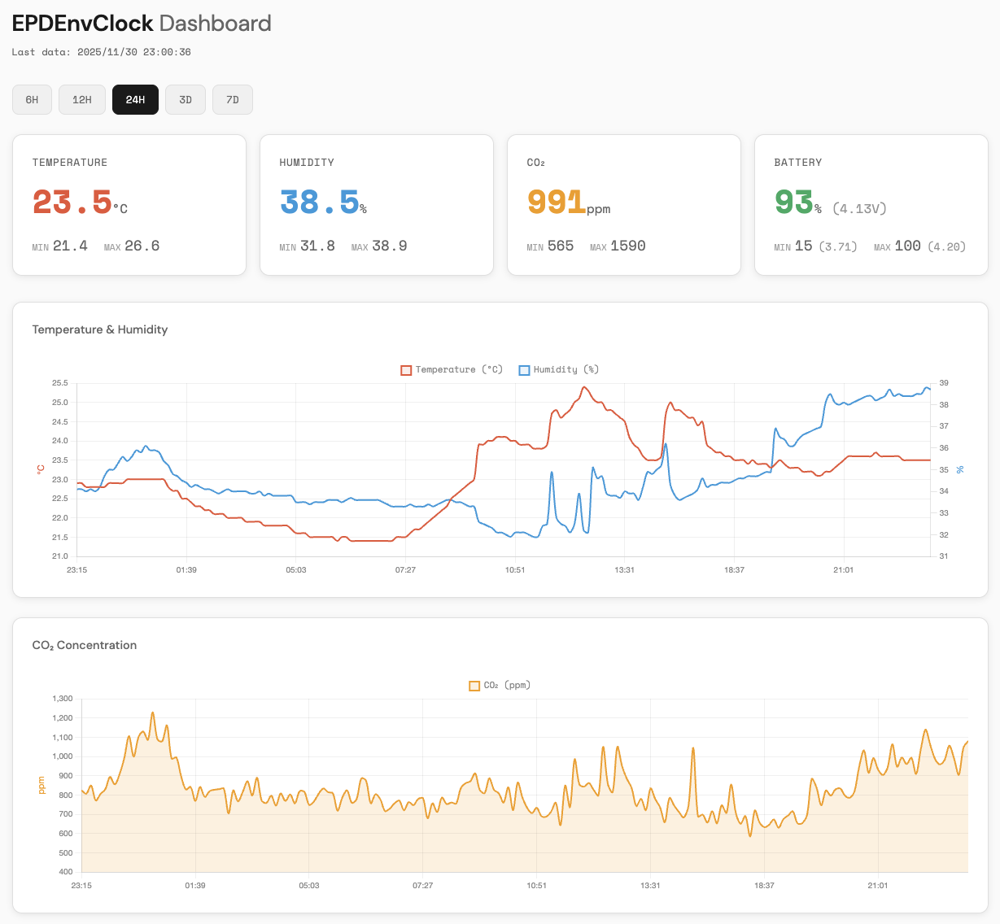

# EPDEnvClock

[日本語版はこちら](README_ja.md)

An ESP32-S3 based e-paper clock project with integrated SCD41 CO2/temperature/humidity sensor, designed for low power consumption and long battery life.

## 📋 Overview

EPDEnvClock is a clock application using the CrowPanel ESP32-S3 E-Paper 5.79" display (792x272 pixels). It provides the following features:



- **Time & Date Display**: Shows time and date with large number fonts
- **Environmental Sensor**: Measures and displays CO2, temperature, and humidity using SCD41 sensor
- **Low Power Design**: Long battery life with Deep Sleep mode (updates approximately every minute)
- **Wi-Fi Connectivity**: NTP time synchronization via Wi-Fi
- **Battery Monitoring**: Real-time battery percentage, voltage, and charging state display using MAX17048 fuel gauge and 4054A CHRG pin
- **Button Wake-up**: Wake from Deep Sleep with HOME button for full screen refresh

## ✨ Main Features

### Display Features

- **Time Display**: Large number font with kerning support
- **Date Display**: Medium-sized number font in YYYY.MM.DD format
- **Sensor Values**: Temperature, humidity, and CO2 concentration with icons
- **Status Display**: Battery % and voltage, Wi-Fi status, NTP sync status, uptime, and free memory

### Sensor Features

- **SCD41 Integration**: Measures CO2 (400-5000ppm), temperature (-10~+60°C), and humidity (0-100%RH)
- **Low Power Mode**: Single-Shot mode with approximately 1.5mA current consumption (waits in Light Sleep)
- **Temperature Compensation**: Temperature offset function to compensate for self-heating (4.0°C)
- **Auto Calibration**: ASC (Automatic Self-Calibration) support

### Power Management

- **Deep Sleep**: Enters Deep Sleep at approximately 1-minute intervals to minimize current consumption
- **Light Sleep**: Uses Light Sleep during 5-second sensor measurement wait to reduce power consumption
- **EPD Deep Sleep**: Display enters Deep Sleep mode to reduce power consumption
- **Frame Buffer Persistence**: Saves frame buffer to SD card or SPIFFS fallback, restores on wake
- **SD Card Power Control**: Powers off SD card during Deep Sleep to reduce current consumption
- **Wi-Fi Power Saving**: NTP sync runs at the top of every hour

### Network Features

- **Wi-Fi Connection**: Connects to configured Wi-Fi (requires recompile to change SSID/password)
- **NTP Sync**: Syncs time from NTP server at the top of every hour (maintains RTC time between syncs)

### Data Logging

- **Sensor Log**: Automatically records sensor values to SD card in JSONL format
- **Recorded Data**: Date, time, Unix timestamp, RTC drift, temperature, humidity, CO2, battery voltage, battery %, charge rate, charging state
- **File Format**: `/sensor_logs/sensor_log_YYYYMMDD.jsonl` (files split by date)

### Button Functions

- **HOME Button (GPIO 2)**: Wake from Deep Sleep and perform full screen refresh
- **Other Buttons**: EXIT (GPIO 1), PRV (GPIO 6), NEXT (GPIO 4), OK (GPIO 5) - for future expansion
- All buttons are active LOW with internal pullup

## 🔧 Hardware Requirements

### Hardware Overview



### Components Built into CrowPanel

- **ESP32-S3 Dev Module**
- **EPD Display**: 792x272 pixels (controlled by two SSD1683 ICs in master/slave configuration)
- **SD Card Slot**: For frame buffer storage (optional, longer write lifespan than SPIFFS)

### External Components

- **SCD41 Sensor**: CO2/temperature/humidity sensor
- **MAX17048 Fuel Gauge**: Battery state-of-charge monitor (Adafruit breakout recommended)

### Pin Configuration

#### SCD41 Sensor (I2C Bus 0)

| Pin | GPIO |
|-----|------|
| SDA | 38 |
| SCL | 20 |
| VDD | 3.3V |
| GND | GND |

**Note**: Pull-up resistors are built into the SCD41 module, no additional hardware required.

#### MAX17048 Fuel Gauge (I2C Bus 1)

| Pin | GPIO / Connection |
|-----|-------------------|
| SDA | 14 |
| SCL | 16 |
| VIN | 3.3V |
| GND | GND |
| CELL+ | LiPo Battery + |
| CELL- | LiPo Battery - (GND) |

**Note**: MAX17048 is powered by the battery, not VIN. The chip will not respond to I2C if battery is not connected.

#### 4054A Charging IC (CHRG Pin)

| Pin | GPIO |
|-----|------|
| CHRG | 8 |

**Note**: CHRG is an open-drain output. LOW = charging, HIGH = not charging (pulled up by internal pullup). Read before I2C operations to avoid noise interference.

#### SD Card (HSPI Bus)

| Pin | GPIO |
|-----|------|
| MOSI | 40 |
| MISO | 13 |
| SCK | 39 |
| CS | 10 |
| Power Enable | 42 |

#### EPD Display (Bit-banging SPI)

| Pin | GPIO |
|-----|------|
| MOSI | 11 |
| SCK | 12 |
| CS | 45 |
| DC | 46 |
| RST | 47 |
| BUSY | 48 |

#### Buttons (Active LOW)

| Button | GPIO |
|--------|------|
| HOME | 2 |
| EXIT | 1 |
| PRV | 6 |
| NEXT | 4 |
| OK | 5 |

## 🚀 Setup

### 1. Required Software

#### USB Serial Driver Installation

CrowPanel ESP32-S3 uses the **CH340** USB serial chip.

- **macOS**: Built-in driver supports serial console only. Official driver required for firmware upload.
- **Windows/Linux**: See driver installation guide.

For all platforms, see: [SparkFun CH340 Driver Guide](https://learn.sparkfun.com/tutorials/how-to-install-ch340-drivers)

Device appears as `/dev/cu.usbserial-*` or `/dev/cu.wchusbserial*` (macOS) when connected.

#### arduino-cli Installation

**macOS**:

```bash
brew install arduino-cli
```

For other platforms, see: [arduino-cli Installation Guide](https://arduino.github.io/arduino-cli/latest/installation/)

#### ESP32 Board Support Installation

This project requires ESP32 Arduino Core **2.0.17** (not 3.x). To avoid conflicts with other projects that may use 3.x, a project-specific Arduino environment is used.

**First-time setup:**

```bash
cd /path/to/EPDEnvClock

# Create project-specific Arduino config
cat > arduino-cli.yaml << 'EOF'
board_manager:
  additional_urls:
    - https://raw.githubusercontent.com/espressif/arduino-esp32/gh-pages/package_esp32_index.json
directories:
  data: /path/to/EPDEnvClock/.arduino15
  downloads: /path/to/EPDEnvClock/.arduino15/staging
  user: ~/Documents/Arduino
EOF

# Install ESP32 core 2.0.17 in project-specific directory
arduino-cli --config-file arduino-cli.yaml core update-index
arduino-cli --config-file arduino-cli.yaml core install esp32:esp32@2.0.17
```

**Note**: Replace `/path/to/EPDEnvClock` with your actual project path. Version 3.x has breaking changes in SPI and other APIs that cause compatibility issues with Adafruit libraries (BusIO, MAX1704X, etc.).

#### Library Installation

```bash
# Sensirion SCD4x library (Sensirion Core dependency is installed automatically)
arduino-cli lib install "Sensirion I2C SCD4x@0.4.0"

# Adafruit MAX17048 fuel gauge library
arduino-cli lib install "Adafruit MAX1704X"
```

### Development Environment Versions

| Component | Version | Notes |
|-----------|---------|-------|
| arduino-cli | Latest recommended | `brew install arduino-cli` (macOS) |
| ESP32 Core | 2.0.17 | `esp32:esp32@2.0.17` (v3.x not compatible with Adafruit libs) |
| Sensirion I2C SCD4x | 0.4.0 | CO2/temperature/humidity sensor library |
| Sensirion Core | 0.7.2 | Dependency (auto-installed) |
| Adafruit MAX1704X | 1.0.3 | Battery fuel gauge library |

#### Check Installed Libraries

```bash
arduino-cli lib list
```

#### Check ESP32 Core Version

```bash
arduino-cli core list
```

### 2. Wi-Fi Configuration

Copy `EPDEnvClock/wifi_config.h.example` to `EPDEnvClock/wifi_config.h` and set your Wi-Fi credentials:

```cpp
#define WIFI_SSID "your_wifi_ssid"
#define WIFI_PASSWORD "your_wifi_password"
```

**Note**: `wifi_config.h` is included in `.gitignore` and will not be committed.

### 3. ImageBW Export Configuration (Debug Feature)

Set server IP address and port in `EPDEnvClock/server_config.h`:

```cpp
#define ENABLE_IMAGEBW_EXPORT 1       // 1 to enable, 0 to disable
#define IMAGEBW_SERVER_IP "192.168.1.100"  // Server IP address
#define IMAGEBW_SERVER_PORT 8080           // Server port
```

## 📦 Build & Upload

### Recommended Method (arduwrap)

`arduwrap` is an arduino-cli wrapper that manages serial port during compile/upload. It runs a background server that monitors the serial port, automatically pauses monitoring during upload, and reconnects after the device resets.

```bash
# Compile and upload (while arduwrap serve is running in another terminal)
scripts/arduwrap compile --fqbn esp32:esp32:esp32s3:PartitionScheme=huge_app,PSRAM=opi EPDEnvClock
```

**Features**:

- Uses project-specific config (`arduino-cli.yaml`) automatically
- `--upload` flag is added automatically
- Port is managed by the running server (no `-p` needed)
- Serial monitoring pauses during upload, then reconnects automatically

**Additional commands**:

```bash
# Get buffered serial log (last 64KB)
scripts/arduwrap log

# Get filtered log with regex
scripts/arduwrap log --filter "ERROR|WARN"

# Get last N lines
scripts/arduwrap log -n 50

# Stop the server
scripts/arduwrap stop
```

**Configuration Parameters**:

- **FQBN**: `esp32:esp32:esp32s3`
- **PartitionScheme**: `huge_app` (Huge APP: 3MB No OTA/1MB SPIFFS)
- **PSRAM**: `opi` (OPI PSRAM)

### Check Port

```bash
arduino-cli board list
```

## 💻 Usage

### Basic Operation

1. **Startup**: Automatically starts when power is supplied to ESP32-S3
2. **Initialization**: Sensor and Wi-Fi initialization (on first boot)
3. **Display Update**: Display updates approximately every minute
4. **Deep Sleep**: Enters Deep Sleep mode after display update
5. **Button Wake**: Press HOME button to wake from Deep Sleep and perform full screen refresh

### Display Layout

Screen layout (792x272 pixels):

- **Top (y=4)**: Status information (battery % and voltage, Wi-Fi status, NTP sync status, uptime, free memory)
- **Upper Left (y=45)**: Date (YYYY.MM.DD format, medium-sized numbers)
- **Center Left (y=123)**: Time (H:MM or HH:MM format, large numbers)
- **Upper Right (y=33)**: Temperature (icon + value + °C unit)
- **Center Right (y=114)**: Humidity (icon + value + % unit)
- **Lower Right (y=193)**: CO2 concentration (icon + value + ppm unit)

### ImageBW Export Feature (Debug)

To send display data to a server via Wi-Fi:

1. **Start Server** (Python 3 required):

   ```bash
   cd /path/to/EPDEnvClock
   python3 scripts/imagebw_server.py --port 8080
   ```

1. **Arduino Configuration**: Set server IP address in `server_config.h`

1. **Auto Send**: ImageBW data is automatically sent whenever the display updates

Received data is saved as PNG files in the `output/` directory.

**Note**: The server runs on any platform with Python 3 (Windows, macOS, Linux, etc.).

See [docs/README_IMAGEBW.md](./docs/README_IMAGEBW.md) for details.

## 📁 Project Structure

```text
EPDEnvClock/
├── EPDEnvClock/                  # Arduino/Firmware code (sketch directory)
│   ├── EPDEnvClock.ino          # Main sketch (setup/loop)
│   ├── EPD.h / EPD.cpp          # Low-level EPD driver
│   ├── EPD_Init.h / EPD_Init.cpp  # EPD initialization
│   ├── spi.h / spi.cpp          # Bit-banging SPI for EPD
│   ├── display_manager.*        # Display rendering, layout
│   ├── fuel_gauge_manager.*     # MAX17048 fuel gauge + 4054A charging detection
│   ├── font_renderer.*          # Glyph drawing with kerning support
│   ├── sensor_manager.*         # SCD41 sensor (single-shot mode with light sleep)
│   ├── sensor_logger.*          # Sensor data logging to SD card
│   ├── network_manager.*        # Wi-Fi connection, NTP sync
│   ├── deep_sleep_manager.*     # Deep sleep, RTC state, SD/SPIFFS frame buffer
│   ├── imagebw_export.*         # ImageBW Export (debug)
│   ├── logger.*                 # Logging with levels (DEBUG/INFO/WARN/ERROR)
│   ├── wifi_config.h            # Wi-Fi credentials (gitignored)
│   ├── secrets.h                # API keys (gitignored)
│   ├── server_config.h          # Server configuration
│   └── bitmaps/                 # Number fonts, icons, units, kerning table
├── scripts/                     # Python scripts
│   ├── arduwrap                 # Arduino CLI wrapper (shell script)
│   ├── arduwrap.py              # Arduino CLI wrapper implementation
│   ├── create_number_bitmaps.py # Number bitmap generation from TTF font
│   ├── convert_numbers.py       # Convert PNG numbers to C header
│   ├── convert_icon.py          # Convert PNG icons to C header
│   ├── imagebw_server.py        # ImageBW receiver server (debug)
│   └── upload_sensor_data.py    # Upload JSONL logs to dashboard API
├── assets/                      # Assets (image files, etc.)
│   ├── Number L/                # Large number font images
│   └── Number M/                # Medium number font images
├── web/                         # Web dashboard (Astro + Cloudflare Pages)
├── docs/                        # Documentation
│   ├── README.md                # Documentation index
│   ├── README_IMAGEBW.md        # ImageBW feature guide
│   ├── README_SCD41.md          # SCD41 sensor guide
│   └── reviews/                 # Code reviews
├── output/                      # Generated image output (gitignore)
└── README.md                    # This file
```

## 📚 Documentation

- **[docs/README.md](./docs/README.md)** - Documentation index
- **[docs/README_IMAGEBW.md](./docs/README_IMAGEBW.md)** - ImageBW Wi-Fi Export feature guide
- **[docs/README_SCD41.md](./docs/README_SCD41.md)** - SCD41 sensor integration guide
- **[web/README.md](./web/README.md)** - Web dashboard documentation

## 🌐 Web Dashboard

The project includes a web dashboard for viewing sensor data, deployed on Cloudflare Pages.



### Local Development

```bash
cd web
bun install
bun run dev
```

Access at <http://localhost:4321/>

### Deployment

```bash
cd web
bun run build
bunx wrangler pages deploy dist --branch=main
```

**Note**: `--branch=main` is required to deploy to production domain. Without it, deploys to preview URL only.

## 🔋 Low Power Design

### Current Consumption

| State | Current Consumption |
|-------|---------------------|
| SCD41 Idle Single-Shot | ~1.5mA |
| MAX17048 Hibernate | ~3µA |
| ESP32-S3 Deep Sleep | ~0.2-0.3mA |
| ESP32-S3 Light Sleep (sensor measurement wait) | ~2-3mA |
| ESP32-S3 Active (including Wi-Fi) | ~80-150mA |

### Battery Life (measured with 1500mAh battery)

- **Average Current Consumption**: ~4.5mA (Wi-Fi sync once per hour)
- **Actual Runtime**: ~224 hours (~9.3 days) to 3.375V
- **Usable Capacity**: ~1000-1100mAh (battery labeled 1500mAh, actual ~1200-1400mAh)

See **[Battery Discharge Report](./docs/BATTERY_REPORT.md)** for detailed analysis.

### Deep Sleep Cycle

- **Update Interval**: ~1 minute (updates at minute boundary)
- **Active Time**: ~6-8 seconds (5s sensor measurement + display update + initialization)
- **Deep Sleep Time**: ~52-54 seconds
- **Wi-Fi Connection**: At the top of every hour for NTP sync

### Power Optimization

1. **Light Sleep During Sensor Measurement**: Uses Light Sleep during 5-second Single-Shot measurement wait
2. **Minimized Wi-Fi Connection**: NTP sync once per hour, uses RTC time otherwise
3. **SD Card Power Control**: Powers off SD card during Deep Sleep (GPIO 42 LOW)
4. **EPD Deep Sleep**: Transitions display to Deep Sleep mode
5. **I2C Pins Held HIGH**: Keeps sensor in idle mode during deep sleep

## 🎨 Font Generation

Number fonts are generated using `scripts/create_number_bitmaps.py`.

### Font Used

**Important**: All number fonts use the following font file:

- **Font Name**: Baloo Bhai 2
- **Style**: Extra Bold

### Number M Font Generation Example

```bash
cd /path/to/EPDEnvClock
python3 scripts/create_number_bitmaps.py \
  --font-path "/path/to/fonts/BalooBhai2-ExtraBold.ttf" \
  --font-size-px 90 \
  --output-dir "assets/Number M"
```

## ⚙️ Technical Specifications

### ESP32-S3 Configuration

- **Board**: ESP32S3 Dev Module
- **Partition Scheme**: Huge APP (3MB No OTA/1MB SPIFFS)
- **PSRAM**: OPI PSRAM
- **CPU Frequency**: 240MHz (Wi-Fi)
- **Flash Mode**: QIO 80MHz
- **Flash Size**: 4MB (32Mb)
- **Upload Speed**: 921600

### EPD Display Specifications

- **Actual Resolution**: 792x272 pixels
- **Controller**: Two SSD1683 ICs in master/slave configuration
  - Each controller: Handles 396x272 pixels
  - 8px address offset in center (handled by software)
- **Program Definition**: `EPD_W = 800`, `EPD_H = 272` (for address offset)
- **Buffer Size**: 27,200 bytes (800×272 pixels ÷ 8 bits)
- **Interface**: Bit-banging SPI (MOSI=11, SCK=12, CS=45, DC=46, RST=47, BUSY=48)

### SCD41 Sensor Specifications

- **I2C Address**: 0x62 (default)
- **I2C Bus**: Wire (Bus 0) - SDA=GPIO 38, SCL=GPIO 20
- **Measurement Mode**: Single-Shot (waits 5 seconds in Light Sleep)
- **Temperature Offset**: 4.0°C (self-heating compensation)
- **Measurement Range**:
  - CO2: 400-5000ppm
  - Temperature: -10~+60°C
  - Humidity: 0-100%RH
- **Accuracy**:
  - CO2: ±(40ppm+5%)
  - Temperature: ±0.8°C (in 15-35°C range)
  - Humidity: ±6%RH (in 15-35°C, 20-65%RH range)

### MAX17048 Fuel Gauge Specifications

- **I2C Address**: 0x36 (default)
- **I2C Bus**: Wire1 (Bus 1) - SDA=GPIO 14, SCL=GPIO 16
- **Power Source**: Powered by battery (requires battery connection to function)
- **Sleep Mode**: Hibernate mode (~3µA current consumption)
- **Measurements**:
  - Battery Voltage: 0-5V
  - State of Charge: 0-100%
  - Charge Rate: %/hr (positive=charging, negative=discharging)
- **Algorithm**: ModelGauge™ for accurate SOC without current sensing

### Time Management

- **NTP Server**: `ntp.nict.jp`
- **Timezone**: JST (UTC+9)
- **Sync Interval**: At the top of every hour
- **RTC Persistence**: Time saved to RTC memory before sleep, restored on wake

### Logger Feature

- **Log Levels**: DEBUG, INFO, WARN, ERROR
- **Timestamp**: Boot time, date/time, or both
- **Tags**: Setup, Loop, Network, Sensor, Display, Font, DeepSleep, ImageBW
- **ANSI Colors**: Color-coded display by log level

## 📝 License

This project is licensed under the MIT License - see the [LICENSE](LICENSE) file for details.

## 📧 Contact

If you have questions or issues with the project, please report them on GitHub Issues.
