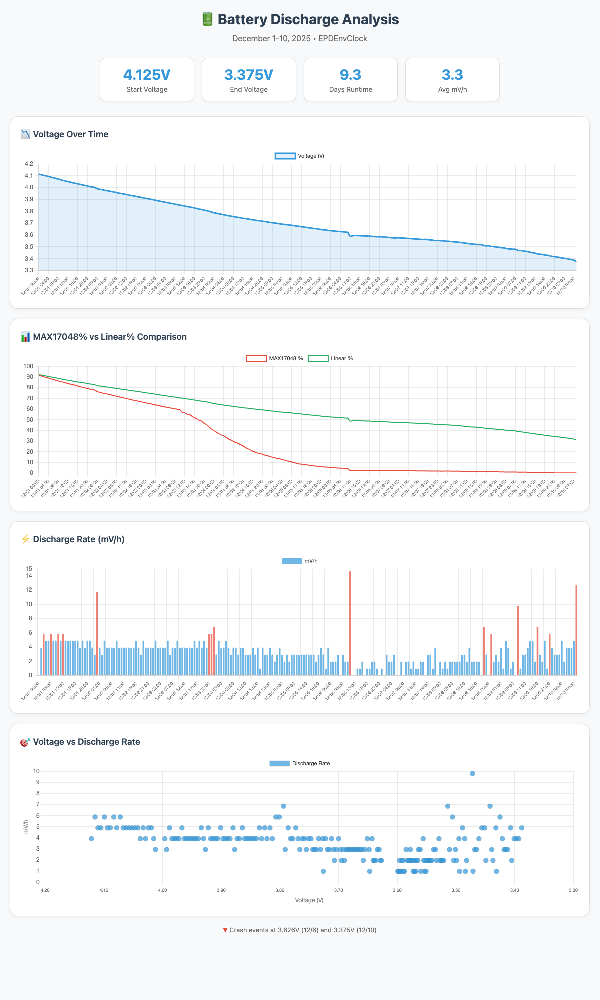

# 🔋 Battery Discharge Report

## Period: December 1-10, 2025 (10 days)

---

## Executive Summary

| Metric | Value |
|--------|-------|
| **Start Voltage** | 4.125V (12/1 00:00) |
| **End Voltage** | 3.375V (12/10 08:00) |
| **Total Discharge** | 750mV |
| **Total Runtime** | ~224 hours (9.3 days) |
| **Average Discharge Rate** | 3.3 mV/h |

---

## Charts



📊 [Interactive Chart (HTML)](battery_chart.html)

---

## Daily Breakdown

| Date | Start V | End V | Drop | mV/h | Events |
|------|---------|-------|------|------|--------|
| 12/01 | 4.125V | 4.012V | 113mV | 4.9 | Normal operation |
| 12/02 | 4.000V | 3.906V | 94mV | 4.4 | Normal operation |
| 12/03 | 3.901V | 3.797V | 104mV | 5.0 | Normal operation |
| 12/04 | 3.794V | 3.712V | 82mV | 3.5 | Discharge slowing |
| 12/05 | 3.709V | 3.643V | 66mV | 2.9 | Discharge slowing |
| 12/06 | 3.641V | 3.589V | 52mV | 1.9 | ⚠️ Crash @ 3.626V (07:29) |
| 12/07 | 3.589V | 3.557V | 32mV | 1.6 | Slowest discharge |
| 12/08 | 3.555V | 3.499V | 56mV | 2.6 | Accelerating again |
| 12/09 | 3.496V | 3.416V | 80mV | 3.5 | Accelerating |
| 12/10 | 3.415V | 3.375V | 40mV | 5.2 | ⚠️ Final crash @ 3.375V |

---

## Discharge Rate Analysis

### Key Findings

1. **Non-linear discharge curve**
   - High voltage (4.1V-3.9V): ~4.5 mV/h
   - Mid voltage (3.9V-3.7V): ~3.5 mV/h  
   - Low voltage (3.7V-3.55V): ~2.0 mV/h (minimum)
   - Very low (3.55V-3.4V): 3.0-5.0 mV/h (accelerating)

2. **Voltage vs MAX17048% accuracy**

   | Voltage | MAX17048% | Linear% | Difference |
   |---------|-----------|---------|------------|
   | 4.12V | 93% | 93% | 0% |
   | 4.00V | 78% | 83% | +5% |
   | 3.90V | 65% | 75% | +10% |
   | 3.80V | 45% | 67% | +22% |
   | 3.70V | 17% | 58% | +41% |
   | 3.60V | 4% | 50% | +46% |
   | 3.50V | 1.5% | 42% | +40% |

---

## Critical Events

### Event 1: First Crash (12/6 07:29)

- **Trigger**: Wi-Fi NTP sync at low voltage
- **Last stable voltage**: 3.626V
- **Symptom**: 5.887V spike → garbage readings → reboot loop
- **Recovery**: Battery unplug/replug

### Event 2: Final Crash (12/10 ~09:00)

- **Last stable voltage**: 3.375V
- **Symptom**: Same pattern - brownout during operation
- **Status**: Continuous reboot loop at ~3.1V

---

## Actual Battery Capacity Analysis

### Rated vs Actual Capacity

| Item | Value |
|------|-------|
| **Rated Capacity** | 1500mAh |
| **Estimated Actual** | 1200-1400mAh |
| **Efficiency** | 80-93% |

### Calculation Method

#### Method 1: Current consumption estimation

Device power profile:

- Deep sleep (53 sec/min): ~10μA
- Active (7 sec/min): ~40mA  
- Wi-Fi (10 sec/hr): ~150mA

```text
Average current ≈ 4.5mA
224 hours × 4.5mA = 1,008mAh consumed (to 3.375V)
```

#### Method 2: Linear % calculation

```text
Linear% consumed: 93.8% → 31.3% = 62.5%
If 1500mAh: 1500 × 0.625 = 937mAh in 224 hours
→ Average 4.2mA ✓ (matches estimate)
```

#### Method 3: Extrapolation to 3.0V

```text
Remaining: 3.375V → 3.0V (31.3% linear remaining)
At ~5mV/h: approximately 75 more hours
Total: 224 + 75 = 299 hours
299h × 4.5mA ≈ 1,345mAh
```

### Verdict

The battery labeled "1500mAh" has an **actual capacity of approximately 1200-1400mAh** (80-93% of rated). This is within normal range for typical LiPo batteries.

---

## Conclusions

1. **Practical minimum voltage**: ~3.4V (with Wi-Fi)
2. **Absolute minimum voltage**: ~3.1V (device cannot start)
3. **Safe operating range**: 4.2V - 3.5V
4. **MAX17048 accuracy**: Good above 3.9V, increasingly pessimistic below
5. **Linear model**: More accurate than MAX17048 below 3.8V

---

## Recommendations

1. **Implement low battery cutoff at 3.5V**
   - Disable Wi-Fi below 3.5V
   - Enter long sleep below 3.4V

2. **Use voltage-based % instead of MAX17048 below 3.8V**

   ```cpp
   if (voltage < 3.8f)
     percent = (voltage - 3.0f) / 1.2f * 100.0f;
   else
     percent = MAX17048_percent;
   ```

3. **Add brownout protection**
   - Check voltage before Wi-Fi operations
   - Skip NTP sync if voltage < 3.5V

---

Report generated: 2025-12-10
